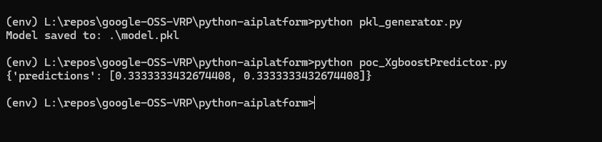
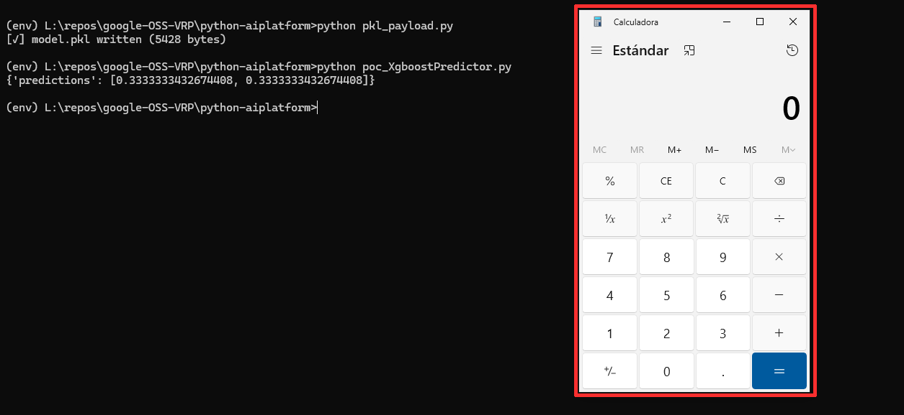
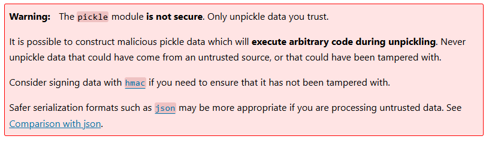

# Command Injection / Remote Code Execution (RCE) via Insecure Deserialization in load() of predictor.py in Vertex AI SDK v1.121.0 - (github.com/googleapis/python-aiplatform)

- Author: Joshua Provoste
- Website: https://joshuaprovoste.com
- Company: https://wl-inc.cl

## Resume

`google-cloud-aiplatform` is Google Cloud's official Python SDK for working with **Vertex AI**. It provides high-level abstractions to create, train, deploy, and use ML models (including AutoML and custom models), and to manage datasets, endpoints, pipelines, and predictions.

* https://pypi.org/project/google-cloud-aiplatform/
* https://github.com/googleapis/python-aiplatform

## About `predictor.py`

This module implements `XgboostPredictor`, a class that adapts `XGBoost` models to Vertex AI's prediction contract. It loads the model artifact from `AIP_STORAGE_URI` (via `prediction_utils.download_model_artifacts`) and accepts several model formats: `.bst`, `.joblib` (with a fallback to `xgboost.Booster` if joblib fails), and `.pkl`; if none are found, it raises a `ValueError` listing the valid filenames.

During a request, it transforms `prediction_input["instances"]` into an `xgb.DMatrix` (preprocess), runs `booster.predict(...)`, and converts the resulting `numpy.ndarray` into `{"predictions": [...]}` (postprocess). In short, it acts as glue between the Vertex AI inference API and a prepackaged XGBoost model, without exposing its own CLI.

## The vulnerable code - L62

That line is the model-loading "plan C": if there's no `.bst` or `.joblib`, it opens the `MODEL_FILENAME_PKL` file in binary mode and uses `pickle.load(...)` to deserialize the previously saved model object, assigning it to booster.

In practice, it reconstructs the estimator (e.g., an `xgboost.Booster` or a compatible wrapper) from a `model.pkl` so it can then be stored in `self._booster` and used in predict. Operational note: loading with pickle requires trusting the artifact (it executes code during deserialization).

* https://github.com/googleapis/python-aiplatform/blob/main/google/cloud/aiplatform/prediction/xgboost/predictor.py#L62


```
    def load(self, artifacts_uri: str) -> None:
        """Loads the model artifact.

        Args:
            artifacts_uri (str):
                Required. The value of the environment variable AIP_STORAGE_URI.

        Raises:
            ValueError: If there's no required model files provided in the artifacts
                uri.
        """
        prediction_utils.download_model_artifacts(artifacts_uri)
        if os.path.exists(prediction.MODEL_FILENAME_BST):
            booster = xgb.Booster(model_file=prediction.MODEL_FILENAME_BST)
        elif os.path.exists(prediction.MODEL_FILENAME_JOBLIB):
            try:
                booster = joblib.load(prediction.MODEL_FILENAME_JOBLIB)
            except KeyError:
                logging.info(
                    "Loading model using joblib failed. "
                    "Loading model using xgboost.Booster instead."
                )
                booster = xgb.Booster()
                booster.load_model(prediction.MODEL_FILENAME_JOBLIB)
        elif os.path.exists(prediction.MODEL_FILENAME_PKL):
            booster = pickle.load(open(prediction.MODEL_FILENAME_PKL, "rb"))
```

The line 62 It expects a binary `.pkl` file serialized with pickle that contains an already trained model object—ideally an `xgboost.Booster` (or equivalent) whose `predict(...)` can operate on an `xgb.DMatrix`, as used by the module.

It does not expect `JSON`, raw weight tensors, or a dictionary: it requires the full Python object exactly as saved with `pickle.dump(model, f, ...)`, and it must be version-compatible (Python/XGBoost) with the environment that loads it.

## Steps to Reproduce:

1. To demonstrate that the module can be manipulated, we will run `pkl_generator.py` to create a valid binary file that `predictor.py` can process; afterwards, we will verify its deserialization by running `poc_XgboostPredictor.py`.



2. Finally, to demonstrate that it's possible to execute commands on the operating system, we will run `pkl_payload.py` to create a binary file that injects commands (in this case, pop a calc), and then execute `poc_XgboostPredictor.py`.



## `poc_XgboostPredictor.py` as realistic PoC

This script is a realistic PoC because it uses only the package's public API (`XgboostPredictor`) and faithfully reproduces the execution flow that would occur in an inference environment: it places `model.pkl` in a simulated artifacts directory, calls `load(artifacts_uri)` (which internally downloads/reads the file), and goes through `preprocess` → `predict` → `postprocess`, matching the SDK's contract. Therefore any malicious model.pkl that executes code on deserialization will be triggered in the same execution context; the proof-of-concept requires no external services or GCP privileges—just the package and the artifact—making it a practical, reproducible demonstration of the vector.


## About the Impact:

The line `booster = pickle.load(open(..., "rb"))` deserializes an arbitrary Python object without filtering: pickle executes code during object reconstruction (via `__reduce__`, calls to importable functions, etc.). **That means if an attacker can control or replace any model.pkl artifact in the project** (for example by uploading it to a bucket, compromising the packaging pipeline, or poisoning an artifacts repository), loading the model can cause arbitrary code execution in the process that performs the load. In a Vertex AI/serving environment this can lead to RCE inside the model-serving container; in CI/CD or build servers the execution happens with the runner’s credentials and privileges; and in a supply-chain scenario a malicious artifact delivered to clients or production can propagate unauthorized execution across many systems. The practical impact ranges from local process execution and data exfiltration to lateral movement and privilege escalation if the vulnerable process has access to keys, storage, or cloud services.

The exploitation path is conceptually simple: cause the target to trust and load a `model.pkl` containing a payload in its `__reduce__` or referencing an importable malicious function; when `pickle.load` is invoked, the payload runs automatically. Therefore the risk is not only in the predictor code but across the entire artifact delivery flow (build, storage, deployment). Practical mitigations are layered and straightforward: avoid deserializing untrusted blobs (use safe formats/serializers that don’t execute code), cryptographically sign and verify artifacts before loading, run model-loading and inference with least privilege, perform inference inside isolated/sandboxed environments, and enforce provenance/auditing for models. Without these defenses, an unchecked `pickle.load` is a direct vector for RCE and large-scale supply-chain attacks.

## Supporting Material/References:

### About `pickle`

* https://docs.python.org/3/library/pickle.html



### About Supply Chain Attacks

This type of vulnerability is commonly exploited in the context of Software Supply Chain Attacks, where an unknown vulnerability is leveraged to poison or compromise services.

In this regard, it directly applies to the following types of Software Supply Chain Attacks:

* Software Supply Chain Compromise → when the attack modifies legitimate components in repositories, pipelines, or dependencies.
* Malicious Package Injection → when an actor directly uploads malicious code to an ecosystem such as npm, PyPI, or RubyGems.
* CI/CD Pipeline Compromise → when integration and deployment systems are manipulated to insert malicious code into the build process.

For example, this has been observed in well-known cases such as Ultralytics / PyPI (2024–2025), Comm100 (2022), GitHub Actions attack on "tj-actions / changed-files" and "reviewdog / action-setup" (2025), and the GitHub Actions Supply Chain Attack (2025, widespread).

* https://www.crowdstrike.com/en-us/blog/new-supply-chain-attack-leverages-comm100-chat-installer/
* https://www.reversinglabs.com/blog/compromised-ultralytics-pypi-package-delivers-crypto-coinminer
* https://unit42.paloaltonetworks.com/github-actions-supply-chain-attack/